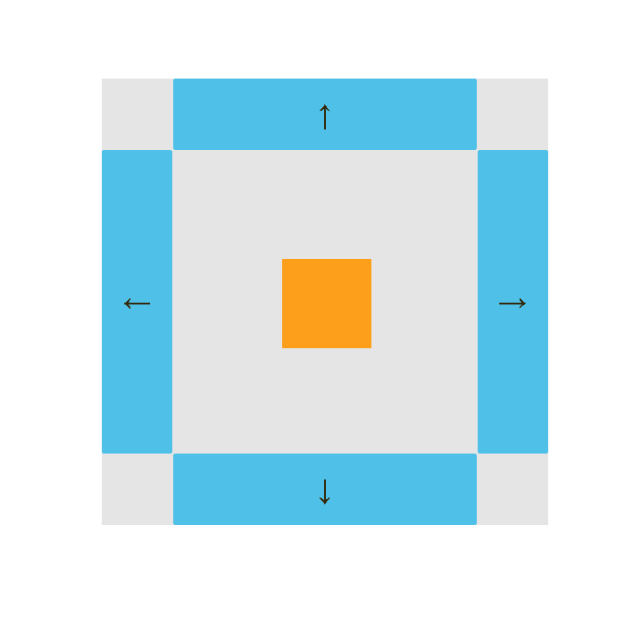

# Moving Square

  

## Description
This is a simple app built using **HTML**, **CSS**, and **JavaScript**. It consist on a simple app where there is a box in center and four buttons on each side. Clicking on each button will move the box to the side button is at. Box should not move beyond limits.

This project was based on the following GIF:

  

## Features
- Interactive functionality with JavaScript.
- Move of container with absolute position.
- Flex layout.