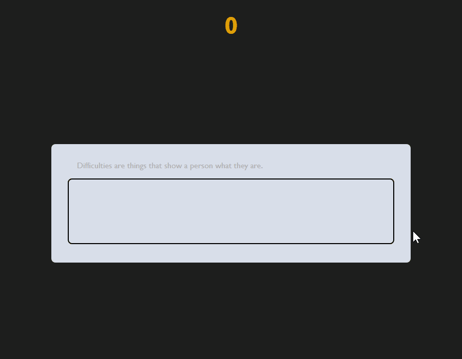

# Typing Game

  

## Description
This is a simple app built using **HTML**, **CSS**, and **JavaScript**. It consists of a simple typing game, with a timer at the top, a random quote (changes when the page is reloaded) and a textarea to start typing and match the quote. The style of the quote will change depending on the input provided, if correct the quote will turn green, if not, it will be underlined and turn red.

This app was based on the following tutorial:
[Build A Speed Typing Game With JavaScript](https://youtu.be/R-7eQIHRszQ?si=5wSUYUQQOf_gi0H6)

## Features
- Interactive functionality with JavaScript.
- Changing styles of component based on functionality.
- Fetching of data from public API.
- Handling of input events.
- Working with timer/intervals.